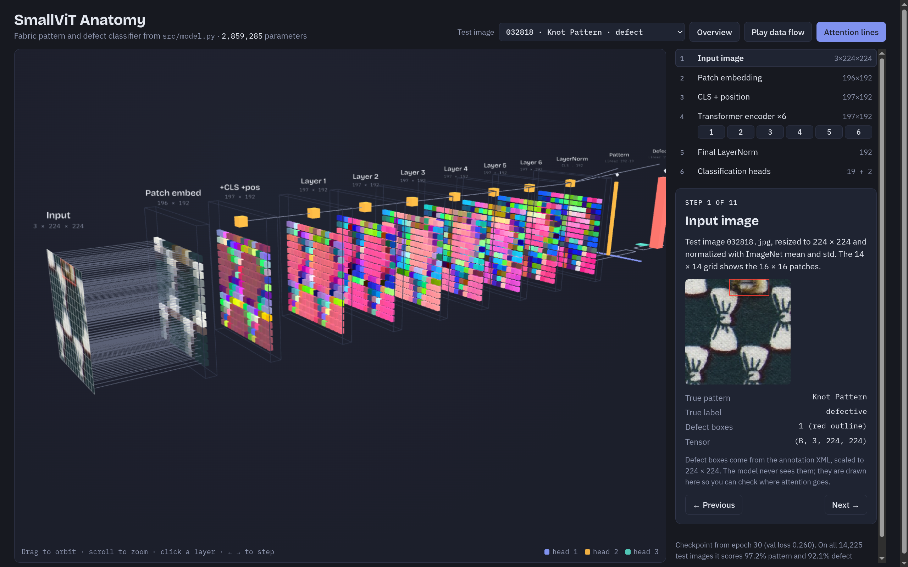

# FabViT


A small Vision Transformer, trained from scratch, that classifies fabric images by **pattern** (19 classes) and **defect** (defective / non-defective) in one pass. It's trained on the [ZJU-Leaper](https://github.com/nico-zck/ZJU-Leaper-Dataset) dataset.



## Model

| | |
|---|---|
| Input | 224 × 224 RGB, 16 × 16 patches → 196 tokens + CLS |
| Encoder | 6 pre-norm layers, dim 192, 3 heads, MLP 768 |
| Heads | `Linear(192, 19)` pattern, `Linear(192, 2)` defect (both from CLS) |
| Training | AdamW (lr 3e-4, wd 0.05), cosine schedule, 30 epochs, summed CE loss |

Test set (14,225 images): **97.2%** pattern accuracy, **92.1%** defect accuracy.

## Usage

Put the dataset in `data/ZJU-Leaper/`, then run from the repo root:

```bash
python src/data_split.py      # 70/15/15 split into split_dataset/
python src/train.py           # best checkpoint → checkpoints/best_model.pth
python src/export_viz.py      # export attention + predictions for the visualizer
```

Open `viz/index.html` in a browser to explore the trained model in 3D. It shows the patch tokens, per-head CLS attention in every layer, and the predictions on real test images.

## Layout

```
src/
  config.py         paths, classes, hyperparameters
  dataset.py        FabricDataset (XML annotations; defective = has bbox)
  transforms.py     train / val augmentations
  model.py          SmallViT
  train.py          training loop
  export_viz.py     writes viz/data.js from the checkpoint
viz/                three.js visualizer
```
